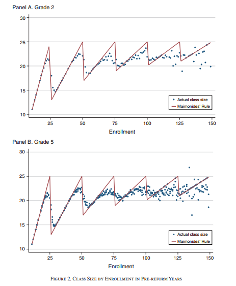
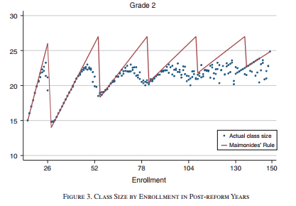
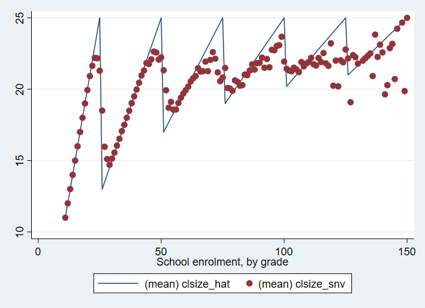
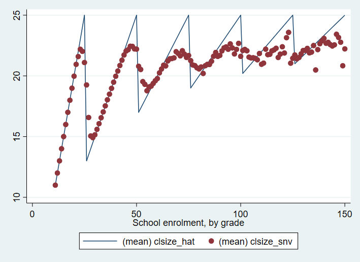
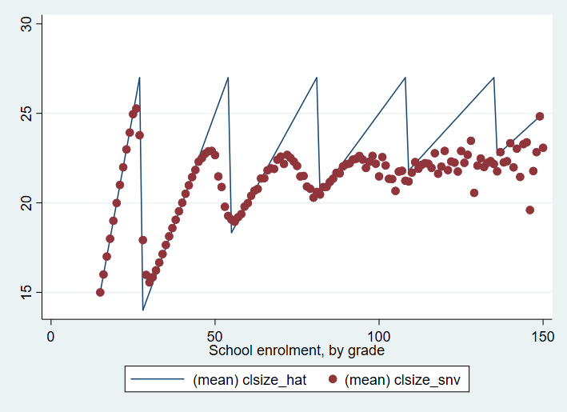

# Validation and Replication results

Data description
================

Data comes from the Italian Instituto Nazionale per la Valutazione del Sistema dell’Istruzione ([INVALSI](invalsi.it)) and is linked to restricted data from the Italian Ministry of Education (MIUR). The data is available on the AEA website as smallmo.dta and smallmo_item.dta. All variables are labeled, given value labels, and given semi-descriptive names. Summary statistics are given in Table 1 of the paper.

The data does not appear to be given a formal bibliography citation in the paper.

Code description
================

ZIP file contains several files, properly described in the README.pdf:

- dofile_publication.do replicates most tables
- balancing.do replicates Table 4.
- sorting.do replicates Tables 9 and A3.
- graphs_rd_classsize.do replicates Figure 4
- graphs_rd_score_and_cheat.do replicates Figures 5 and 6
- score_gradient.do replicates Figure 7

In some cases, it is necessary to comment or uncomment certain lines in the code so as to produce the desired result.

Data checks
===========

- PII_stata_scan.do ran successfully. Results are included in pii_stata_output.csv
- Data is in custom DTA format and can be opened and read without error.

Replication steps
=================

1. Downloaded code and data from AEA website.
2. Unzipped the file.
3. Ran PII_stata_scan
4. Walked through the paper, stopping at each table/figure/in-text number and looking in the code for it.
5. Where possible, if code was not provided, attempted to replicate a number on my own. Code provided.

Findings
========

## Tables
- Table 1: Contains a number of mismatches in point estimates, although all differences are minor, mismatches described in Excel file. In some places, it appears that North/South results were swapped. Standard deviations frequently mismatch with the code for class-level variables. The versions in the paper look more accurate, but there is not code to generate them.
- Table 2: Replicated. Lines 171 and 172 needed to be swapped off to get all columns correctly.
- Table A1: Code produced an error.
- Table 3: Replicated. Lines 171 and 172 needed to be swapped off to get all columns correctly.
- Table 4: Columns 2, 4, 6 replicated. No code provided for columns 1, 3, 5.
- Table 5: Code produced an error.
- Table 6: Minor inconsistencies.
- Table 7: Minor inconsistencies.
- Table 8: Lots of minor inconsistencies.
- Table 9: Columns 2, 4, 6 replicated. No code provided for columns 1, 3, 5.
- Table 3A: Replicated.

## Figures
- Figures 1: no program provided.
- Figures 2 and 3: No program provided. Instructions for replication in README.pdf produced close to (but not exactly) the desired result for 2a, but there were notable inconsistencies in 2b and 3 for higher levels of `students`.

Figure 2 Paper version:

Figure 3 Paper version:


Code for Figure 2 suggested by README.pdf:
```stata
use "smallmo.dta", clear

*Keep cap = 25, as indicated by figure footnote
keep if (grade == 0) | (grade == 1 & survey == 2009)

*Keep students <= 150, as suggested by published image but specified nowhere.
keep if students <= 150

*collapse as instructed by README.pdf
collapse (mean) clsize_snv clsize_hat, by(students grade)

*graph
sort students
*Figure 2a
tw line clsize_hat students if grade == 1 || sc clsize_snv students if grade == 1
*Figure 2b
tw line clsize_hat students if grade == 0 || sc clsize_snv students if grade == 0
```

Figure 2 Replicated. Note small inconsistencies around `students = 120, classize = 20`:


Figure 2 Replicated. Note heavy inconsistencies at high levels of `students`:


Code for Figure 2 suggested by README.pdf:
```stata
use "smallmo.dta", clear

*Keep cap = 25, as indicated by figure footnote
keep if (grade == 1 & survey > 2009)

*Keep students <= 150, as suggested by published image but specified nowhere.
keep if students <= 150

*collapse as instructed by README.pdf
collapse (mean) clsize_snv clsize_hat, by(students grade)

*graph
sort students
*Figure 3
tw line clsize_hat students || sc clsize_snv students
```

Figure 3 Replicated. Note heavy inconsistencies at high levels of `students`:


- Figure 4: Replicated successfully.
- Figure 5 and 6: Replicated successfully.
- Figure 7: Replicated successfully.


## In-Text Numbers

*REPLICATION REPORT QUESTION: should in-text numbers that only refer to an in-table number be included? I did not do this.*

- Test scores should be standardized within grade/year/subject but this does not appear to be the case. Unless I missed something, grade standardization did not appear to work properly. Means are indeed near zero, but variances, stated to be 1 in the paper, are considerably below 1, as checked by "by survey grade, sort: summ answers_*_std"
- Paper claims to drop classes from 2011 smaller than 15 students but this did not occur.


Classification
==============

I would classify this as a full replication. There are a lot of numbers that appear to be mis-transcribed from the results, but differences are very small (often it appears that they were just rounding errors; the worst case was a set of standard errors being divided by 10, but this did not change significance). There were some tables for which the code didn't run properly, which is a potential concern. The inability to properly replicate the Maimonides graphs is also a potential problem, although this is more likely due to imprecise instructions rather than a mistake in the code.

Probably the *biggest* concern in this replication is that the dependent variable does not appear to be properly standardized, such that the standard deviation is below 1. This affects the interpretation of all results. For example, p235: "Monitoring also reduces language scores by 0.08$\sigma$." This interpretation comes from the coefficient of -0.081. However, since the standard deviation of the dependent variable is not 1, the effect is not in fact 0.08$\sigma$, but rather in the range of about 0.11$\sigma$. So unless I've missed something big, all effect sizes are thus understated (or, perhaps, there is some error in the way the dependent variable is calculated; I could not check this in the code).

- [x] full replication
- [ ] partial replication (see above)
- [ ] not able to replicate (reasons see above)
